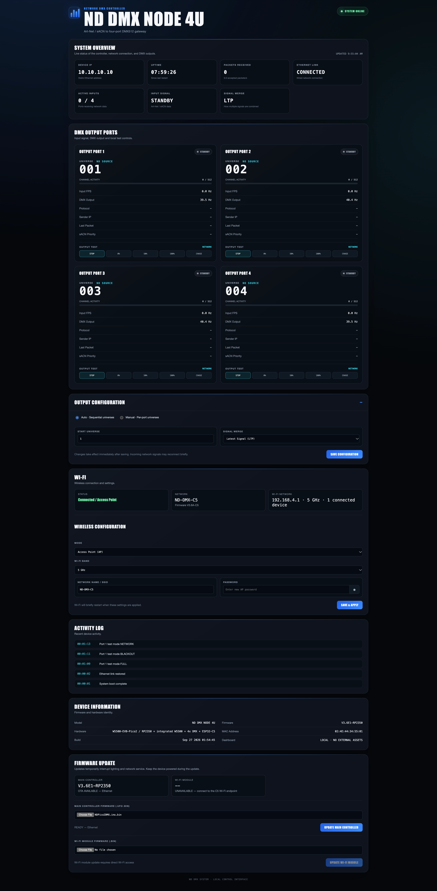

# ND Pico2DMX Node

ND Pico2DMX Node is a compact network-to-DMX controller with four independent DMX outputs. It receives Art-Net or sACN over Ethernet or Wi-Fi and sends standard DMX to lighting fixtures.

```text
Lighting Console / Computer
          |
     Art-Net / sACN
          |
    Ethernet / Wi-Fi
          |
   +----------------+
   | ND Pico2DMX   |
   +----------------+
      |  |  |  |
      |  |  |  +-- DMX OUT 4
      |  |  +----- DMX OUT 3
      |  +-------- DMX OUT 2
      +----------- DMX OUT 1
```

Each output can use its own universe and protocol mode. The node includes direct Ethernet operation, Wi-Fi access through the ESP32-C5, a browser dashboard, FULL / BLACKOUT / NETWORK output testing, and dashboard firmware updates.

## Features

- Four independent DMX outputs
- Art-Net and sACN input over Ethernet or Wi-Fi
- Per-output universe and protocol configuration
- Browser dashboard for monitoring, testing, and firmware updates
- RP2350 main controller with ESP32-C5 Wi-Fi control processor

## Dashboard



The dashboard provides live system status, DMX output monitoring, configuration, test controls, and the controlled Ethernet update path for the main controller.

## Current release

**ND Pico2DMX Node v1.0.0**

- Main Controller: `V3.6F5-RP2350`
- Wi-Fi Controller: `V3.6A-C5`
- First GitHub release

## Project status

The hardware-validated production baseline includes successful F4 → F5 Ethernet OTA validation and real-output verification.

## Quick start

Begin with the [Getting Started guide](docs/GETTING_STARTED.md), then review [Wiring and connections](docs/WIRING.md) and [Network setup](docs/NETWORK_SETUP.md).

## Documentation

- [Getting started](docs/GETTING_STARTED.md)
- [Wiring and connections](docs/WIRING.md)
- [Network setup](docs/NETWORK_SETUP.md)
- [Dashboard guide](docs/DASHBOARD.md)
- [Firmware updates](docs/FIRMWARE_UPDATE.md)
- [Troubleshooting](docs/TROUBLESHOOTING.md)
- [Technical overview](docs/TECHNICAL_OVERVIEW.md)
- [Changelog](CHANGELOG.md)
- [Release notes](docs/RELEASE_NOTES_v1.0.0.md)

## Validated production baseline

- RP2350: `V3.6F5-RP2350`
- ESP32-C5: `V3.6A-C5`
- Four physical DMX outputs validated
- F4 → F5 RP Ethernet OTA validated on hardware

Licensing is currently undecided; see [LICENSE](LICENSE).

## Repository layout

- `firmware/` — current production source
- `docs/` — operator and technical documentation
- `hardware/` — known hardware notes
- `archive/bringup-tests/` — historical development and hardware-validation projects

Firmware binaries are intentionally not committed to the normal source tree. Versioned binaries can be published later through GitHub Releases.
